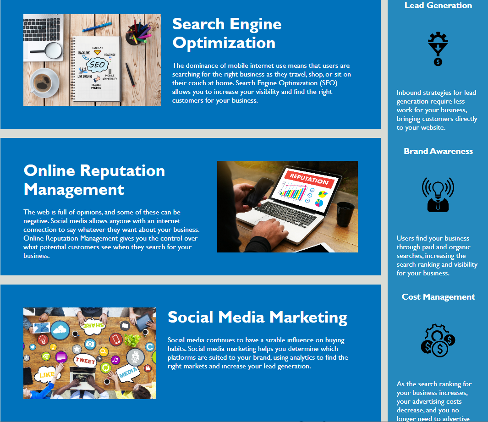

# HW-1-Horiseon

## Description

This project took an existing marketing website and updated it's HTML. I did this by refactoring the code and replacing div tags with semantic elements. I also added alt tags to all of the photos to allow for the website to have more accessibility to all users. This refactoring not only allows for the code to be accessed and read more easily by fellow coders, but also allows for better search engine optimization.    

## Website Link
[Visit Horiseon Website](https://estilbee.github.io/HW-1-Horiseon/)

### Technologies Used
<ul>
   <li> HTML </li>
   <li> CSS </li>
</ul>

### Website Photos

 

Thank you for reading!